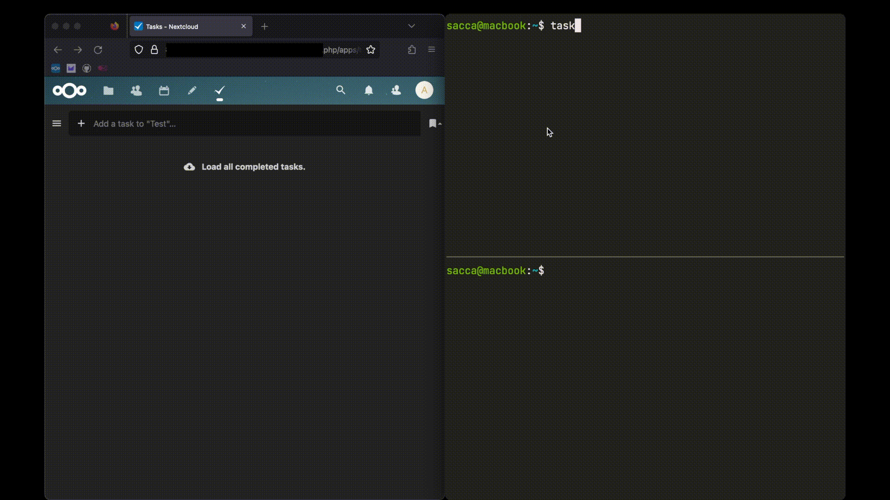

# [Taskwarrior](https://taskwarrior.org/) ⬄ CalDAV Server

## Description

Synchronize Taskwarrior tasks to a generic CalDAV server.
This service has been tested using a self-hosted
[nextcloud](https://nextcloud.com/) server as well as , but should theoretically
work with any server that implements the [CalDAV
specification](https://www.rfc-editor.org/rfc/rfc4791)

Upon execution, `tw_caldav_sync` will synchronize, and on subsequent runs of the
program keep synchronized, the following attributes (TW entries will be
converted to a vCard format and visa versa):

## Demo - first run - populating tasklist in Nextcloud



### Mappings

`tw_caldav_sync` will make the following mappings between items:

- `description` ↔ `SUMMARY`
- `status` ↔ `STATUS`
  - `pending`, `waiting` ↔ `NEEDS-ACTION` (using custom CalDAV attribute)
  - `completed` ↔ `COMPLETED` / `CANCELLED` (using custom CalDAV attribute)
    `caldav_completion_status`, in Taskwarrior to mark cancelled items)
  - `deleted` ↔ (deletion of CalDAV item)

Regarding timestamps:

- TW `entry` ↔ `CREATED`
- TW `end` ↔ `COMPLETED`
- TW `modified` ↔ `LAST-MODIFIED`
- TW `prioriy` ↔ `PRIORITY`
  - `""` ↔ `None`
  - `L` ↔ 9
  - `M` ↔ 5
  - `H` ↔ 1
- TW `annotations` ↔ `DESCRIPTION` (one annotation ↔ one line in description)
- TW `uuid` ↔ `X-SYNCALL-TW-UUID`
- TW wait status ↔ `X-SYNCALL-TW-WAITING`
- TW `tags` ↔ `CATEGORIES`

### Current limitations

- No specific support for "waiting" tasks in Taskwarrior, they will be treated
  like any other "needs-action" CalDAV task
- No support for recurring tasks sync in either direction

## Installation

Install the `syncall` package from PyPI, enabling the CalDAV and `Taskwarrior`
extra:

```sh
pip3 install 'syncall[caldav, tw]'
```

## Usage

### Taskwarrior

You can synchronize a series of Taskwarrior tasks that have a particular
(or multiple) tags or synchronize all the tasks that belong to a particular
project.

Use `--taskwarrior-tags ...` or `--taskwarrior-project` respectively for the
above

### CalDAV

In order to successfully run a sync, you will need the following flags set (mandatory):

- `--caldav-url`: URL where the CalDAV calendar is hosted at (including `/dav` if applicable)
- `--caldav-user`: Username required to authenticate your CalDAV instance
  - Can also be provided via the `CALDAV_USERNAME` environment variable
- `--caldav-passwd`, `--caldav-passwd-pass-path`: Path to your password `.gpg` file in your [password store](https://wiki.archlinux.org/title/Pass)
  - Alternatively, the password can be provided directly via the `CALDAV_PASSWD` environment variable

The following flag is optional:

- `--calendar`: Name of the CalDAV Calendar to sync (will be created if not there), will default to `Personal` if not set

### Example Usage

With flags:

```sh
tw_caldav_sync --caldav-url https://nextcloud.example.com/remote.php/dav --caldav-calendar MyCalendar --caldav-user myUser --caldav-passwd path/to/myPass --taskwarrior-tags sync
```

With environment variables:

```sh
CALDAV_USERNAME=myUser CALDAV_PASSWD=myPass tw_caldav_sync --caldav-url https://nextcloud.example.com/remote.php/dav --caldav-calendar MyCalendar --taskwarrior-tags sync
```

## Future Work

- [ ] See if we can handle TW "waiting" tasks a little better (possibly by
      setting the CalDAV `start` field to when the wait expires)
- [ ] Consider how to refactor out extra steps in conversion, and just store
      CalDAV items in their vTodo formats (though this will make test files much
      uglier)

## See also

- <a href="https://github.com/bergercookie/syncall/blob/master/docs/taskwarrior-filtering.md">Taskwarrior Filtering.md</a>.
