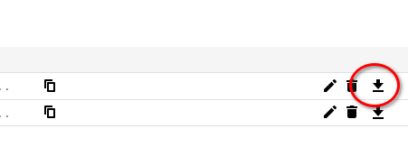

# [Taskwarrior](https://taskwarrior.org/) ⬄ [Google Calendar](https://calendar.google.com/)

Given all the entries of a _Calendar_ of Google Calendar with all the tasks of a
taskwarrior _filter_ (currently only a single tag is supported and tested)
synchronise all the events between them.

## Demo - first run - populating calendar in GCal


## Motivation

While Taskwarrior is an excellent tool when it comes to keeping TODO lists,
keeping track of project goals etc., lacks the portability, simplicity and
minimalistic design of Google Calendar. The latter also has the following
advantages:

- Automatic sync across all your devices
- Comfortable addition/modification of events using voice commands
- Actual reminding of events with a variety of mechanisms

## Override Calendar API key

Unfortunately I've yet to verify this app with Google so new users are
currently blocked from using it. To bypass that you can register for your own
developer account with the Google Calendar API with the following steps:

Firstly, removed the `~/.gcal_credentials.pickle` file on your system since that
will be reused if found by the app.

For creating your own Google Developer App:

- Go to the Google developer console
- Make a new project
- From the sidebar go to `API & Services` and once there click the `ENABLE APIS AND SERVICES` button
- Look for and Enable the `Calendar API`

Your newly created app now has access to the Calendar API. We now have to create
and download the credentials:

- Again, from the sidebar under `API And Services` click `Credentials`
- Enable the `Calendar API`
- On the sidebar click `Credentials`, and once there click `CREATE CREDENTIALS`
- Create a new `OAuth Client ID`. Set the type to `Desktop App` (app name is not
  important).
- Finally download the credentials in JSON form by clicking the download button
  as shown below. This is the file you need to point to when running
  `tw_gcal_sync`.

  

To specify your custom credentials JSON file use the `--gcal-secret` flag as follows:

```sh
tw_gcal_sync -c "<calendar-name>" -t "<taskwarrior-tag>" --gcal-secret "<path/to/downloaded/json/file>"
```

## Usage instructions

Run the `tw_gcal_sync` to synchronise the Google calendar of your choice with
the selected Taskwarrior tag(s). Run with `--help` for the list of options.

```sh
# Sync the +remindme Taskwarrior tag with the calendar named "TW Reminders"

tw_gcal_sync --help
tw_gcal_sync -t remindme -c "TW Reminders"
```

## Troubleshooting

- Having trouble installing or using the tool? Take a look at either the
  continuous-integration configuration or the unittsests for the installation
  steps or the recommended way of using the python code respectively.
- Something doesn't work? Does the script fail midway through?

  - Record the problem and report it in the ISSUES page. Include as much
    information as possible so that I can reproduce it.
  - Clean the configuration file. By default that's going to be:

    `$HOME/.config/taskwarrior_syncall/tw_gcal_sync.yaml`

  - Remove the corresponding Google Calendar
  - Rerun synchronization from scratch to populate Google Calendar with all the
    events from your selected taskwarrior filter.

## FAQ

<details>
  <summary>How do I mark an item as done from Google Calendar?</summary>

If the item was created from Taskwarrior then there should be a `status:
pending` line in its description. Change it to `status: done` or `status:
completed`.

</details>
