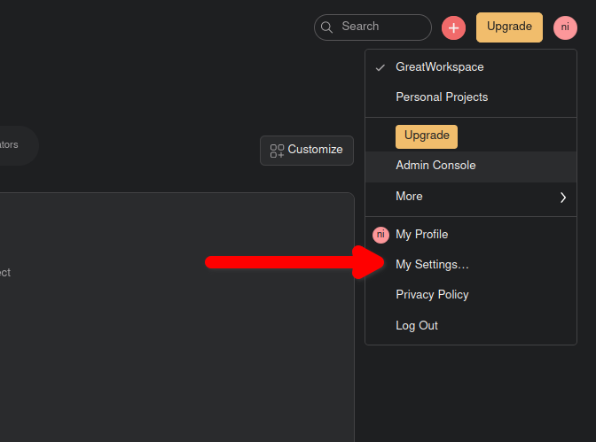
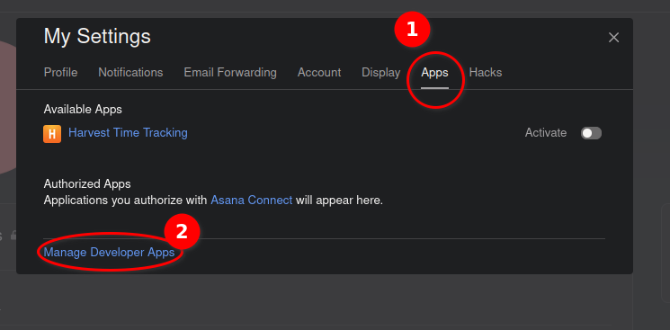
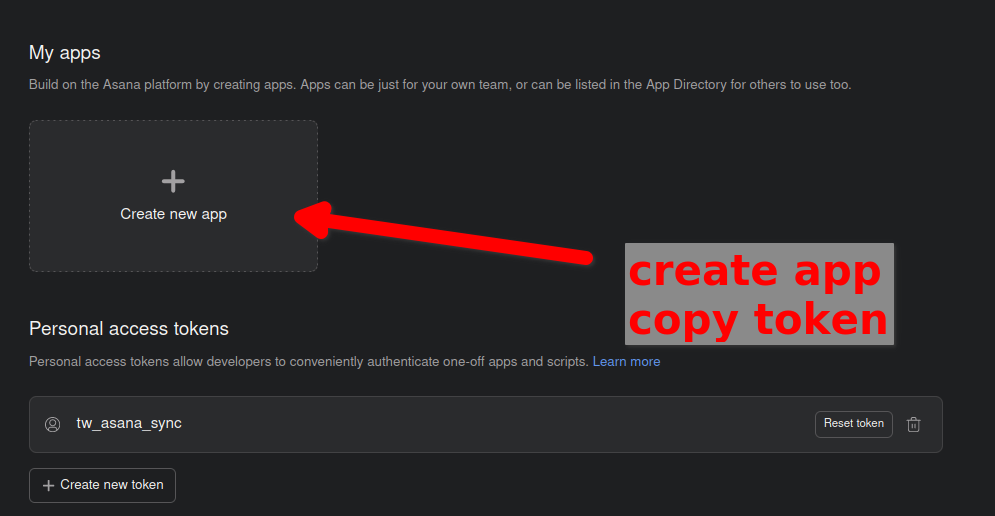

# [Taskwarrior](https://taskwarrior.org/) ⬄ [Asana](https://www.asana.com)

## Description

Synchronize Asana tasks.

Upon execution, `tw_asana_sync` will synchronize, and on subsequent runs of the
program keep synchronized, the following attributes:

- Asana task `name` <-> TW task `description`
- Asana task `completed` <-> TW task `status`
- Asana task `due_at` or `due_on` <-> TW task `due`
- Asana task is deleted <-> TW task is deleted

Current limitations:

- Does not sync Asana tags, project names, subtasks, projects, likes, etc.
- Does not sync Taskwarrior tags, projects, annotations, etc.
- Only supports authentication with an Asana [Personal Access Token](https://developers.asana.com/docs/personal-access-token)
- Only syncs Asana tasks that are assigned to the user associated with that access token

## Setup and UsageUsage

You can find synchronize a series of Taskwarrior tasks that have a particular
(or multiple) tags or synchronize all the tasks that belong to a particular
project.

Use `--taskwarrior-tags ...` or `--taskwarrior-project` respectively for the
above

### Authenticate

First, generate a [personal access token](https://developers.asana.com/docs/personal-access-token)on Asana.

 |  |  |
|:---:|:---:|:---:|

Next, make this token available to `tw_sync_asana`. This can be done by either:

- Storing the token in environment variable `ASANA_PERSONAL_ACCESS_TOKEN`.
- Storing the token with [password store](https://www.passwordstore.org/),
  and telling Asana to load the token with `--token-pass-path`.

### Find IDs of available workspace

```sh
$ tw_asana_sync --list-asana-workspaces

Asana workspaces:
====================

- My Workspace: gid=123456789012345
```

### Synchronize all workspace tasks

To synchronize Asana tasks within a workspace:

```sh
tw_asana_sync --taskwarrior-tags asana --asana-workspace-gid 123456789012345 --token-pass-path <path-to-asana-token-in-password-store>
```

Or:

```sh
tw_asana_sync --taskwarrior-tags asana --asana-workspace-name my-workspace --token-pass-path <path-to-asana-token-in-password-store>
```

### Pass the Access Token via environment variable

If you haven't installed or don't want to install [password
store](https://www.passwordstore.org/) you can pass the access token via an
environment variable

```sh
ASANA_PERSONAL_ACCESS_TOKEN=123456789012345 tw_asana_sync -t asana -W my-workspace
```

## Installation

### Package Installation

Install the `syncall` package from PyPI, enabling the `asana` and `tw` extras:

```sh
pip3 install syncall[asana,tw]
```
