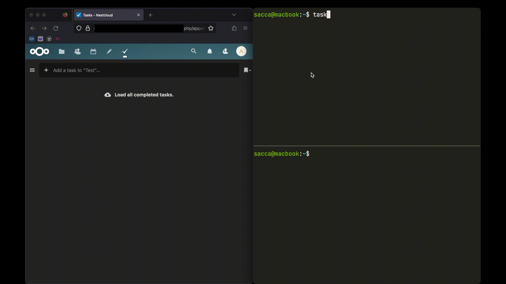

# [Taskwarrior](https://taskwarrior.org/) ⬄ Caldav Server

## Description

Synchronize taskwarrior tasks to a generic caldav server.
This service has been tested using a self-hosted [nextcloud](https://nextcloud.com/) server as well as , but should theoretically work with any server that implements the [caldav specification](https://www.rfc-editor.org/rfc/rfc4791)

Upon execution, `tw_caldav_sync` will synchronize, and on subsequent runs of the
program keep synchronized, the following attributes (tw entries will be converted to a vCard format and visa versa):

## Demo - first run - populating tasklist in Nextcloud



### Mappings

TW <-> Caldav will make the following mappings between items:

- `description` <-> `SUMMARY`
- `status` <-> `STATUS`
  - `pending`, `waiting` <-> `NEEDS-ACTION`
  - `completed` <-> `COMPLETED`
  - `deleted` <-> `CANCELLED`
- TW `modified` <-> `LAST-MODIFIED`
- TW `prioriy` <-> `PRIORITY`
  - `""` <-> `None`
  - `L` <-> 9
  - `M` <-> 5
  - `H` <-> 1
- TW `annotations`, `uuid` <-> `DESCRIPTION`
- TW `tags` <-> `CATEGORIES`

### Current limitations

- No specific support for "waiting" tasks in taskwarrior, they will be treated like any other "needs-action" caldav task
- No support for recurring tasks sync in either direction

## Installation

Install the `syncall` package from PyPI, enabling the `caldav` and `taskwarrior`
extra:

```sh
pip3 install syncall[caldav, taskwarrior]
```

## Usage

### Taskwarrior

You can synchronize a series of Taskwarrior tasks that have a particular
(or multiple) tags or synchronize all the tasks that belong to a particular
project.

Use `--taskwarrior-tags ...` or `--taskwarrior-project` respectively for the
above

### Caldav

In order to successfully run a sync, you will need the following flags set (mandatory):

- `--caldav-url`: URL where the caldav calendar is hosted at (including `/dav` if applicable)
- `--caldav-user`: Username required to authenticate your caldav instance
  - Can also be provided via the `CALDAV_USERNAME` environment variable
- `--caldav-passwd`, `--caldav-passwd-pass-path`: Path to your password `.gpg` file in your [password store](https://www.passwordstore.org/)
  - Alternatively, the password can be provided directly via the `CALDAV_PASSWD` environment variable

The following flag is optional:

- `--calendar`: Name of the caldav Calendar to sync (will be created if not there), will default to `Personal` if not set

### Example Usage

With flags:

```
tw_caldav_sync --caldav-url https://nextcloud.example.com/remote.php/dav --caldav-calendar MyCalendar --caldav-user myUser --caldav-passwd path/to/myPass --taskwarrior-tags sync
```

With environment variables:

```
CALDAV_USER=myUser CALDAV_PASSWD=myPass tw_caldav_sync --caldav-url https://nextcloud.example.com/remote.php/dav --caldav-calendar MyCalendar --taskwarrior-tags sync
```

## Future Work

- [ ] See if we can handle TW "waiting" tasks a little better (possibly by setting the caldav `start` field to when the wait expires)
- [ ] Consider how to refactor out extra steps in conversion, and just store caldav items in their vTodo formats (though this will make test files much uglier)
